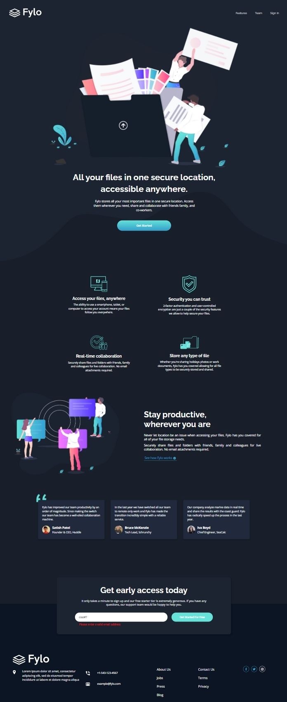
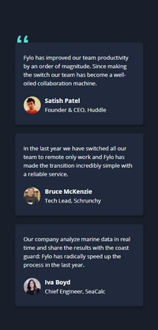
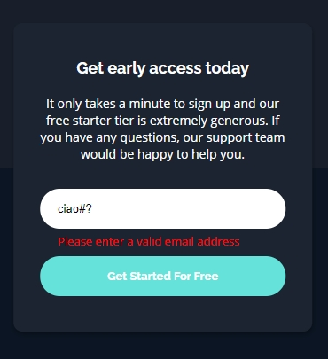
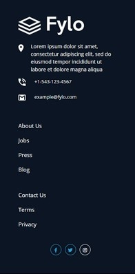

# Solution for the Frontend Mentor - Fylo landing page dark theme and features grid challenge.

 
 
This is my solution for the Fylo Landing Page challenge by [Frontend Mentor](https://www.frontendmentor.io). Above you can see the screenshots for the desktop version at 1440px width.

The challenge consists in realizing a responsive landing page for the fictional storage company Fylo.

I solved the challenge using only HTML, CSS/SASS and Javascript (no framework).

The Fylo landing ha page has six main sections, below a brief description with screenshots of the mobile version of the app at 375px width:  

<ul>
<li>A hero section with the Fylo logo,  a nav bar and a call to action (the get started button)   

</li>
<li>A features section with cards arranged in a grid, displaying the different features of the product.     

</li>

</li>
<li>A "productive" section, inviting the potential customer to see how Fylo works.
 

</li>

</li>
<li>A testimonial section with cards reporting opinions from fictional customers.

</li>
</li>
<li>A sign-up section at the bottom of the page inviting the customer to leave an email address. When the user submits the email there is a basic check for its correct formation.  
 

</li>

</li>
<li>A footer with contacts, social links and links to other possible pages of the Fylo website
 
 

</li>
</li>
</ul>
 
 

My solution to the Fylo Landing Page Challenges is also live on [github pages](https://aleperf.github.io/fylo-dark-theme-landing-page/)
